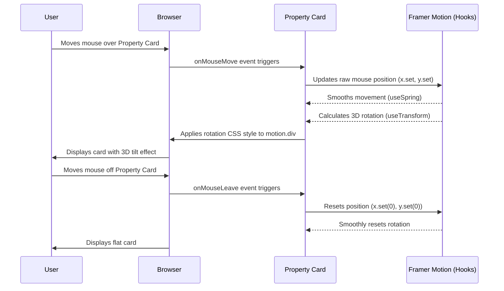

# Chapter 1: UI Design System (Glassmorphism & Framer Motion)

## Introduction: Making HomeStead Haven Shine

Welcome to HomeStead Haven! Imagine stepping into a luxury store versus a regular shop. It's not just about what they sell, but how everything looks and feels. HomeStead Haven aims for that same "premium" experience online. We want our website to feel modern, sophisticated, and even a little bit magical, with elements that pop out and react to your touch.

This chapter is all about understanding the core ingredients that give HomeStead Haven its unique visual style and lively animations. We'll explore:

*   **Glassmorphism**: How we create those sleek, translucent, "frosted glass" effects.
*   **Framer Motion**: How we add smooth, engaging animations, like cards that gently tilt as your mouse moves over them.

Our central goal for this chapter is to understand how we can make something as simple as a property listing card on our website feel luxurious and interactive, almost like a physical object you can playfully interact with.

## What is a UI Design System?

Think of a UI (User Interface) Design System as the "style guide" or "recipe book" for an entire website or application. It's a collection of rules, guidelines, and components that ensure everything looks and behaves consistently.

For HomeStead Haven, our UI Design System is defined by two main concepts:

*   **Aesthetic (Looks)**: This is where **Glassmorphism** comes in. It dictates the visual style, colors, and textures.
*   **Animation (Movement)**: This is handled by **Framer Motion**, which adds dynamic, interactive elements to the UI.

Together, they create the premium, "3D-inspired" look and feel of HomeStead Haven.

## Concept 1: Glassmorphism – The "Glassy" Look

Have you ever seen frosted glass windows or panels? Glassmorphism is a design trend that brings this aesthetic to digital interfaces. It uses transparency, blur, and subtle shadows to make elements look like they are made of translucent glass, floating above the background. This creates a sense of depth and elegance.

### Why Glassmorphism for HomeStead Haven?

*   **Premium Feel**: It looks modern, clean, and sophisticated, perfectly matching the luxury real estate theme.
*   **Depth**: By blurring elements behind a "glass" layer, it adds a subtle 3D effect.
*   **Light & Airy**: The transparency keeps the interface from feeling heavy or cluttered.

### The Key Ingredients of Glassmorphism (with Tailwind CSS)

We use a tool called **Tailwind CSS** to easily apply these styles. Here’s what makes up a Glassmorphism effect:

1.  **Transparency**: The element itself is semi-transparent, allowing the background to show through. (e.g., `bg-white/60` means white color with 60% opacity).
2.  **Background Blur**: Crucially, the content *behind* the element is blurred. This is what gives it the "frosted glass" effect. (e.g., `backdrop-blur-xl`).
3.  **Subtle Border**: A thin, light-colored border often helps define the edges of the "glass" element. (e.g., `border border-white/50`).

Let's look at a super simplified example of how we'd create a glassy box using Tailwind CSS:

```html
<div class="bg-white/60 backdrop-blur-xl rounded-2xl border border-white/50 p-6 shadow-lg">
  <p class="text-slate-800 dark:text-white">I am a glassy box!</p>
</div>
```

**Explanation:**
*   `bg-white/60`: Sets the background color to white with 60% opacity.
*   `backdrop-blur-xl`: This is the magic! It applies a large blur effect to whatever is *behind* this `div`.
*   `rounded-2xl`: Makes the corners nicely rounded.
*   `border border-white/50`: Adds a subtle white border with 50% opacity.
*   `p-6`: Adds some padding inside.
*   `shadow-lg`: Gives a soft shadow to lift the box slightly.

This combination of classes transforms a regular `div` into a beautiful, glassy component, like you see on many parts of the HomeStead Haven website, especially the interactive cards and fixed footers.

## Concept 2: Framer Motion – Bringing UI to Life

While Glassmorphism handles the looks, **Framer Motion** is our engine for making things move and interact. It's a powerful and easy-to-use animation library for React (the technology HomeStead Haven is built with). It lets us add smooth transitions, hover effects, and even complex 3D movements without writing a lot of complicated code.

### Why Animations are Important for HomeStead Haven?

*   **Engagement**: Moving elements grab attention and make the experience more fun.
*   **Feedback**: Animations can show users that something happened (e.g., a button was clicked, a page loaded).
*   **Premium Feel**: Smooth, deliberate animations make an application feel polished and high-quality.
*   **Tactile Interaction**: It makes digital elements feel more like physical objects you can interact with.

### Key Features of Framer Motion for HomeStead Haven

Framer Motion is used throughout HomeStead Haven for various effects, including:

1.  **3D Tilt Effects**: Making cards slightly rotate when you move your mouse over them, as seen in property listings.
2.  **Smooth Entrance Animations**: Elements gently fading in or sliding into view as you scroll down a page.
3.  **Interactive Hover States**: Buttons or images subtly changing when your mouse hovers over them.

Let's look at a simple example of how Framer Motion can make an element appear smoothly:

```jsx
import { motion } from 'framer-motion'; // 1. Import motion

function GreetingBox() {
  return (
    // 2. Use motion.div instead of a regular div
    <motion.div
      initial={{ opacity: 0, y: 50 }} // 3. Start invisible, 50px below final position
      animate={{ opacity: 1, y: 0 }}   // 4. End fully visible, at original position
      transition={{ duration: 0.8 }}   // 5. Make the animation last 0.8 seconds
      class="bg-emerald-500 text-white p-4 rounded-lg"
    >
      <p>Hello from HomeStead Haven!</p>
    </motion.div>
  );
}
```

**Explanation:**
1.  We import `motion` from the `framer-motion` library.
2.  Instead of a standard `<div>`, we use `motion.div`. This tells Framer Motion to manage animations for this element.
3.  The `initial` prop defines how the element looks *before* the animation starts. Here, `opacity: 0` means it's invisible, and `y: 50` means it's 50 pixels lower than its final spot.
4.  The `animate` prop defines how the element should look *after* the animation. Here, `opacity: 1` makes it fully visible, and `y: 0` moves it to its original vertical position.
5.  The `transition` prop customizes the animation, like how long it should take (`duration: 0.8` seconds).

This simple code makes the `GreetingBox` smoothly fade in and slide up when it appears on the screen.

## Putting It Together: The Interactive Property Card

Now, let's combine Glassmorphism and Framer Motion to achieve one of HomeStead Haven's signature features: the interactive, 3D-tilting property card you see on the homepage and property listings. This is a great example from our `PropertyCard.tsx` file.

### Glassmorphism on the Property Card

First, the card itself has that premium, translucent look thanks to Glassmorphism. If you look at the `PropertyCard.tsx` file, the main container `div` uses these Tailwind classes:

```html
<div class="bg-white/60 dark:bg-slate-800/60 backdrop-blur-xl rounded-[2rem] ... border border-white/50 dark:border-slate-700/50">
    <!-- ... card content ... -->
</div>
```

This makes the card appear as a floating, frosted-glass panel that beautifully displays the property information. The `dark:bg-slate-800/60` and `dark:border-slate-700/50` classes ensure it looks great in dark mode too!

### Framer Motion on the Property Card

Now, for the exciting part: the animations! Framer Motion adds two main effects to our property cards:

1.  **Smooth Entrance Animation**: When a property card first appears as you scroll, it doesn't just pop in. It smoothly fades up, making the page feel more dynamic.
    ```jsx
    <motion.div
      // ... other props for tilt ...
      initial={{ opacity: 0, y: 30 }} // Start invisible, slightly below
      whileInView={{ opacity: 1, y: 0 }} // Fade in and move to position when in view
      viewport={{ once: true, margin: "-50px" }} // Animate only once when it enters view
      className="relative w-full h-full group"
    >
        {/* ... rest of the card content ... */}
    </motion.div>
    ```
    This `initial` and `whileInView` setup (from `PropertyCard.tsx`) ensures that each card animates into view elegantly as you scroll down the page. The `viewport` prop ensures this animation happens only once when the card first becomes visible.

2.  **The 3D Tilt Effect**: This is the most impressive part! As your mouse moves over a card, it subtly tilts, giving it a tactile, almost 3D feel. This effect is created using several Framer Motion hooks: `useMotionValue`, `useSpring`, and `useTransform`.

Let's simplify the core tilt logic from `PropertyCard.tsx` to understand it better:

```jsx
import { motion, useMotionValue, useSpring, useTransform } from 'framer-motion';
import React from 'react'; // Don't forget to import React!

function SimpleTiltingCard() {
  const x = useMotionValue(0); // Tracks raw mouse X position relative to card center
  const y = useMotionValue(0); // Tracks raw mouse Y position relative to card center

  // Smooth out the raw mouse positions
  const mouseX = useSpring(x, { stiffness: 500, damping: 100 });
  const mouseY = useSpring(y, { stiffness: 500, damping: 100 });

  // Convert smoothed mouse positions into rotation values (small degrees)
  const rotateX = useTransform(mouseY, [-100, 100], [2, -2]); // Mouse Y changes card's X-axis rotation
  const rotateY = useTransform(mouseX, [-100, 100], [-2, 2]); // Mouse X changes card's Y-axis rotation

  // When the mouse moves over the card
  function onMouseMove({ currentTarget, clientX, clientY }: React.MouseEvent) {
    // Calculate mouse position relative to the card's center
    const { left, top, width, height } = currentTarget.getBoundingClientRect();
    x.set(clientX - left - width / 2); // Update x MotionValue
    y.set(clientY - top - height / 2); // Update y MotionValue
  }

  // When the mouse leaves the card
  function onMouseLeave() {
    x.set(0); // Reset x to 0 (no horizontal tilt)
    y.set(0); // Reset y to 0 (no vertical tilt)
  }

  return (
    <motion.div
      style={{ rotateX, rotateY, perspective: 1000 }} // Apply the calculated rotations
      onMouseMove={onMouseMove} // Call onMouseMove when mouse moves
      onMouseLeave={onMouseLeave} // Call onMouseLeave when mouse leaves
      className="bg-white/60 backdrop-blur-xl rounded-2xl shadow-lg w-64 h-80 flex items-center justify-center cursor-pointer"
    >
      <p className="font-bold text-slate-800 dark:text-white">Hover and move your mouse!</p>
    </motion.div>
  );
}
```

**How the 3D Tilt Works (Step-by-Step):**

1.  **Tracking Mouse Position**: When your mouse hovers over the card, the `onMouseMove` function continuously runs. It figures out where your mouse is *relative to the center of the card*.
2.  **`useMotionValue`**: This Framer Motion hook acts like a special variable that stores the raw X and Y positions of your mouse. It updates whenever your mouse moves.
3.  **`useSpring` for Smoothness**: The raw mouse movements can be jerky. `useSpring` takes these raw `x` and `y` values and applies a "spring physics" effect, making the resulting `mouseX` and `mouseY` values super smooth and natural, like a real physical object.
4.  **`useTransform` for Rotation**: We don't want the card to rotate directly by the mouse position (that would be too much!). `useTransform` takes the smoothed `mouseX` and `mouseY` values and *transforms* them into smaller rotation values (like `-2 degrees` to `2 degrees`).
    *   Moving the mouse up/down (`mouseY`) affects the card's `rotateX` (tilting it forward/backward).
    *   Moving the mouse left/right (`mouseX`) affects the card's `rotateY` (tilting it left/right).
5.  **`motion.div` Applies Style**: Finally, the `motion.div` component applies these `rotateX` and `rotateY` values as CSS transformations to the card's style. The `perspective: 1000` CSS property is essential here, as it's what makes the rotation appear as a 3D effect.
6.  **Reset on Leave**: When your mouse leaves the card, `onMouseLeave` resets the `x` and `y` motion values back to `0`, causing the card to smoothly return to its flat state.

This combined effect of Glassmorphism (for the look) and Framer Motion (for the interactive tilt) is what makes HomeStead Haven's property cards feel so premium and engaging.

## Under the Hood: How the Magic Happens

Let's quickly visualize the interaction when you hover your mouse over a property card.



### Connecting to Code Files

This entire UI Design System isn't just in one place; it's integrated throughout the project.

*   **Tailwind CSS Setup (`index.html`)**: Our `index.html` file includes the Tailwind CSS library and sets up custom fonts. It also defines custom CSS animations like `@keyframes blob` which are used in `App.tsx` for the dynamic background gradients. These background animations, while not Framer Motion, contribute to the overall lively feel.
    ```html
    <script src="https://cdn.tailwindcss.com"></script>
    <script>
      tailwind.config = {
        darkMode: 'class', // Enables dark mode based on 'dark' class
        theme: {
          extend: {
            fontFamily: {
              sans: ['Plus Jakarta Sans', 'sans-serif'],
            }
          }
        }
      }
    </script>
    <link href="https://fonts.googleapis.com/css2?family=Plus+Jakarta+Sans:wght@300;400;500;600;700&display=swap" rel="stylesheet">
    <style>
      /* ... custom scrollbar and blob animations ... */
    </style>
    ```
    This setup ensures that all our Tailwind Glassmorphism classes and custom animations work across the application.

*   **Global Glassmorphism & Animations (`App.tsx`)**: The main `App.tsx` file wraps our entire application in a `Layout` component. This layout is where some global Glassmorphism and dynamic background effects are applied, like the persistent fixed contact footer:
    ```jsx
    <div className="fixed bottom-0 left-0 right-0 z-[60] bg-white/40 dark:bg-slate-950/40 backdrop-blur-xl border-t border-white/20 dark:border-slate-800/50 py-2.5 px-4 text-center">
      {/* ... footer content ... */}
    </div>
    ```
    Notice the `bg-white/40`, `dark:bg-slate-950/40`, and `backdrop-blur-xl` here, creating a subtle, semi-transparent base for our contact information. The animated gradient blobs in the background also add to the dynamic, 3D-inspired feel, even though they use pure CSS animations (`animate-blob`) rather than Framer Motion directly.

*   **Interactive Components (`components/PropertyCard.tsx`)**: This is where Framer Motion and Glassmorphism truly come together to create a reusable, interactive element. As discussed, the property card combines the glassy background with entrance animations and the interactive 3D tilt.

## Conclusion

In this chapter, you've learned that HomeStead Haven's unique "premium, 3D-inspired" look isn't just magic; it's a carefully designed UI system. We achieve this by combining:

*   **Glassmorphism**: Using Tailwind CSS for elegant, translucent "frosted glass" elements.
*   **Framer Motion**: For dynamic, engaging animations like 3D tilt effects and smooth transitions.

The property card serves as a perfect example of these two concepts working in harmony to create a truly immersive and tactile user experience.

These visual styles and animations provide the foundation for our entire platform. But how is the whole website structured to consistently apply these styles? In the next chapter, we'll dive into the broader picture of how the overall layout and theming (like light and dark mode) are managed across HomeStead Haven.

[Next Chapter: Global UI Layout & Theming](02_global_ui_layout___theming_.md)

---
