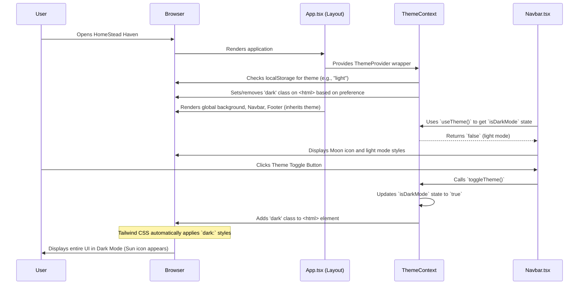

# Chapter 2: Global UI Layout & Theming

Welcome back to HomeStead Haven! In [Chapter 1: UI Design System (Glassmorphism & Framer Motion)](01_ui_design_system__glassmorphism___framer_motion__.md), we explored how individual elements, like property cards, get their stunning looks and interactive animations. We learned how to design beautiful "rooms" for our digital house.

But what about the house itself? Imagine a magnificent building where every room is exquisitely designed, yet the main entrance is missing, the hallways are inconsistent, and you can't easily switch between a bright daytime ambiance and a cozy evening glow. That wouldn't make for a great experience, would it?

This chapter is all about HomeStead Haven's "architectural blueprint" and "interior design scheme." It defines the core structure that holds all our beautiful components together, ensuring a consistent user experience across every page, and allowing users to personalize the app's look with light and dark themes.

We'll dive into:

*   **The Global Layout**: How we ensure every page has a consistent navigation bar, footer, and a dedicated space for its unique content.
*   **Theming (Light & Dark Mode)**: How users can switch between two distinct visual themes, and how the entire application instantly adapts.
*   **Dynamic Backgrounds**: The subtle, animated gradients and patterns that give HomeStead Haven its premium feel, adapting to the chosen theme.

Our central goal for this chapter is to understand how, with minimal effort, we can make sure a user always sees a familiar navigation at the top, essential information at the bottom, and can flip a switch to transform the app's entire color palette, all while the background gracefully shifts.

## What is a Global UI Layout?

Think of a Global UI Layout as the "skeleton" of your entire application. It's a reusable wrapper that defines common elements that appear on almost every page, such as:

*   **Navigation Bar (Navbar)**: The menu at the top, allowing users to move between different sections (Home, Properties, Profile).
*   **Footer**: The section at the bottom, usually containing copyright info, contact details, and quick links.
*   **Main Content Area**: The dynamic space in the middle where the specific content of each page (like a list of properties or a sign-in form) is displayed.
*   **Global Backgrounds**: Consistent visual elements that appear behind all other content.

By using a global layout, we don't have to rebuild the Navbar or Footer for every single page. We define them once, and the layout component includes them automatically.

## What is Theming? (Light & Dark Mode)

Theming refers to the ability to change the overall visual style of an application. For HomeStead Haven, this primarily means switching between a "Light Mode" (bright backgrounds, dark text) and a "Dark Mode" (dark backgrounds, light text).

### Why Theming is Important for HomeStead Haven?

*   **User Preference**: Many users prefer dark mode for reduced eye strain, especially in low-light conditions.
*   **Accessibility**: Offers choice, which improves usability for a wider audience.
*   **Modern Aesthetic**: A well-implemented dark mode contributes to a polished, premium feel.

## Use Case: Consistent UI and Theme Toggle

Let's consider a practical example. A user visits HomeStead Haven, browses properties, and then checks their profile. Throughout this journey, they expect to see the same elegant navigation bar at the top and a clear footer at the bottom. Furthermore, they want the option to instantly switch the entire app's look from bright to dark with a single click, and have that preference remembered for future visits.

This entire experience is made possible by our Global UI Layout and Theming system.

## How HomeStead Haven Achieves This

HomeStead Haven uses a central `Layout` component to wrap all its pages. This `Layout` component is responsible for rendering the fixed `Navbar`, `Footer`, and managing the dynamic background. To handle theming, we employ a React Context called `ThemeContext`, which allows any component to know the current theme and toggle it.

### 1. Wrapping Pages with the `Layout` Component

In our `App.tsx` file, we use the `Layout` component to wrap all our application routes. This means no matter which page the user navigates to, it will always be displayed *inside* our `Layout`.

```jsx
// App.tsx - Simplified
import React from 'react';
import { Routes, Route } from 'react-router-dom';
import Navbar from './components/Navbar'; // Our navigation
import Footer from './components/Footer'; // Our footer

// The Layout component wraps everything
const Layout: React.FC<{ children: React.ReactNode }> = ({ children }) => (
  <div className="min-h-screen relative font-sans pb-10">
    {/* Background elements go here */}
    <div className="fixed inset-0 ..."></div>
    
    <Navbar /> {/* This Navbar will appear on every page */}
    <div className="flex-grow relative z-10">
      {children} {/* This is where the specific page content loads */}
    </div>
    <Footer /> {/* This Footer will appear on every page */}
  </div>
);

const App: React.FC = () => {
  return (
    <Router>
      <Layout> {/* All our routes are rendered within the Layout */}
        <Routes>
          <Route path="/" element={<Home />} />
          <Route path="/properties" element={<Properties />} />
          {/* ... other pages ... */}
        </Routes>
      </Layout>
    </Router>
  );
};

export default App;
```

**Explanation:**
The `Layout` component acts like a frame. It renders the `Navbar` (top), `Footer` (bottom), and a `div` that holds `{children}`. The `{children}` is a special React prop that represents whatever components are placed *inside* `Layout` when it's used. In `App.tsx`, these children are our `Routes` component, which then displays the `Home` page, `Properties` page, and so on. This simple structure guarantees that `Navbar` and `Footer` are always present and consistent.

### 2. Toggling Themes with `useTheme`

To allow users to switch between light and dark mode, we provide a theme toggle button in the `Navbar`. This button uses a special `useTheme` hook to interact with our theming system.

```jsx
// components/Navbar.tsx - Theme toggle snippet
import { useTheme } from '../context/ThemeContext'; // Get our theme tools
import { Sun, Moon } from 'lucide-react'; // Icons for light/dark mode

const Navbar: React.FC = () => {
  const { isDarkMode, toggleTheme } = useTheme(); // 1. Use the hook to get theme state and function

  return (
    <nav className="fixed top-0 z-50 bg-white/90 dark:bg-slate-900/90 ...">
      {/* ... other Navbar content ... */}
      <button 
        onClick={toggleTheme} // 2. Call toggleTheme when the button is clicked
        className="p-2 rounded-full text-slate-500 dark:text-slate-400 hover:bg-slate-100 dark:hover:bg-slate-800 transition-colors"
      >
        {isDarkMode ? <Sun size={20} className="text-amber-400" /> : <Moon size={20} className="text-slate-600" />}
      </button>
      {/* ... other navigation links ... */}
    </nav>
  );
};
```

**Explanation:**
1.  We `import { useTheme }` from our `ThemeContext`. This hook provides us with two things: `isDarkMode` (a `true`/`false` value indicating the current theme) and `toggleTheme` (a function to switch the theme).
2.  The `<button>`'s `onClick` event calls `toggleTheme()`. When this happens, our theme system updates, and the entire application instantly shifts its colors. The icon also changes based on `isDarkMode`. Notice the `dark:` classes (e.g., `dark:bg-slate-900/90`) directly within the `Navbar`'s `className` — these are how elements automatically adapt.

## Under the Hood: How the Magic Happens

Let's uncover the mechanisms that power HomeStead Haven's consistent layout and dynamic theming.

### Step-by-Step Flow: Page Load and Theme Toggle

Here’s a simplified look at what happens when you visit HomeStead Haven and toggle the theme:

1.  **Application Initialization**: When you first open HomeStead Haven, `App.tsx` is loaded. It sets up the `ThemeProvider` (which manages theme state) and the `Layout` component.
2.  **Theme Preference Check**: The `ThemeProvider` immediately checks your browser's local storage to see if you've previously saved a theme preference (light or dark). If not, it defaults to light mode.
3.  **Applying Base Theme**: Based on the detected (or default) theme, the `ThemeProvider` adds or removes a special `dark` class to the main `<html>` element of your webpage.
4.  **Layout Renders**: The `Layout` component then renders. It includes the `Navbar` and `Footer` components. It also renders background elements (like animated gradient "blobs" and a dot pattern) that dynamically change their appearance based on whether the `dark` class is present on `<html>`.
5.  **Component Styling**: All components, like `Navbar` and `Footer`, read the current theme state (directly or indirectly). They use Tailwind CSS classes with the `dark:` prefix. Because the `<html>` element has (or doesn't have) the `dark` class, Tailwind CSS automatically applies the correct set of styles for either light or dark mode.
6.  **User Toggles Theme**: When you click the theme toggle button in the `Navbar`, it calls the `toggleTheme()` function provided by the `ThemeProvider`.
7.  **Theme State Update**: `toggleTheme()` updates the `isDarkMode` state within the `ThemeProvider`.
8.  **HTML Class Update**: A React "effect" within the `ThemeProvider` detects this change. It then *removes* the `dark` class from `<html>` if switching to light, or *adds* it if switching to dark. This action also saves the new preference to local storage.
9.  **Instant UI Refresh**: Because the `<html>` class changes, Tailwind CSS immediately re-evaluates all `dark:` prefixed styles across the entire application. Every component, from the Navbar to the Footer to the background blobs, instantly updates its appearance without needing to reload the page!

This process ensures that your chosen theme is applied consistently and efficiently across the entire application.



### Connecting to Code Files

This global layout and theming system is primarily orchestrated by three key files: `App.tsx`, `components/Navbar.tsx` (and other components like `Footer.tsx`), `context/ThemeContext.tsx`, and `index.html`.

#### 1. `App.tsx`: The Architectural Blueprint

The `Layout` component inside `App.tsx` is the foundation. It wraps all other components, providing the consistent elements and the dynamic background.

```jsx
// App.tsx - Snippet of Layout component structure
const Layout: React.FC<{ children: React.ReactNode }> = ({ children }) => (
  <div className="min-h-screen relative text-slate-900 dark:text-slate-100 transition-colors duration-300 flex flex-col overflow-x-hidden font-sans pb-10">
    
    {/* Dynamic Background Layer - Responds to theme */}
    <div className="fixed inset-0 -z-10 h-full w-full bg-slate-50 dark:bg-slate-950 transition-colors duration-500 overflow-hidden">
        {/* Animated Gradient Blobs - Light Mode only */}
        <div className="dark:hidden absolute top-0 -left-4 w-96 h-96 bg-emerald-300 ..."></div>
        {/* Animated Gradient Blobs - Dark Mode only */}
        <div className="hidden dark:block absolute top-0 -left-4 w-96 h-96 bg-emerald-900/40 ..."></div>
    </div>
    
    <Navbar /> {/* The always-present navigation */}
    <div className="flex-grow relative z-10">
      {children} {/* This is where page-specific content (Home, Properties) goes */}
    </div>
    <Footer /> {/* The always-present footer */}

    {/* Fixed Contact Footer - also uses Glassmorphism and adapts to theme */}
    <div className="fixed bottom-0 left-0 right-0 z-[60] bg-white/40 dark:bg-slate-950/40 backdrop-blur-xl border-t border-white/20 dark:border-slate-800/50 py-2.5 px-4 text-center">
      {/* ... contact info ... */}
    </div>
  </div>
);
```

**Explanation:**
The `Layout` component defines the overall structure. It sets base text colors (`text-slate-900 dark:text-slate-100`) and a smooth `transition-colors` for the whole application.
Crucially, it hosts the background layers. Notice how the light mode blobs use `dark:hidden` (meaning they disappear in dark mode), while the dark mode blobs use `hidden dark:block` (meaning they appear only in dark mode). This is a powerful Tailwind CSS pattern that relies entirely on the `dark` class being present on `<html>`. The fixed contact footer also demonstrates Glassmorphism combined with theme adaptation (`bg-white/40 dark:bg-slate-950/40`).

#### 2. `components/Navbar.tsx` & `components/Footer.tsx`: Implementing the Design

These components are placed directly within the `Layout`. They use Tailwind CSS `dark:` classes to adapt their own appearance.

```jsx
// components/Navbar.tsx - Snippet showing dark mode usage
import { useTheme } from '../context/ThemeContext'; 

const Navbar: React.FC = () => {
  const { isDarkMode, toggleTheme } = useTheme();

  return (
    <nav className="fixed top-0 left-0 right-0 z-50 bg-white/90 dark:bg-slate-900/90 backdrop-blur-md shadow-sm border-b border-slate-100 dark:border-slate-800 transition-colors duration-300">
      {/* ... logo, search, etc. ... */}
      <button onClick={toggleTheme} className="p-2 rounded-full text-slate-500 dark:text-slate-400 hover:bg-slate-100 dark:hover:bg-slate-800 transition-colors">
        {isDarkMode ? <Sun size={20} className="text-amber-400" /> : <Moon size={20} className="text-slate-600" />}
      </button>
      {/* ... profile link with dark: border ... */}
    </nav>
  );
};

// components/Footer.tsx - Snippet showing dark mode usage
const Footer: React.FC = () => {
  return (
    <footer className="bg-white/80 dark:bg-slate-900/80 backdrop-blur-md border-t border-slate-200 dark:border-slate-800 pt-16 pb-8 text-slate-600 dark:text-slate-400 relative z-20">
      {/* ... content with text-slate-500 dark:text-slate-400 ... */}
    </footer>
  );
};
```

**Explanation:**
Both `Navbar.tsx` and `Footer.tsx` directly apply Tailwind CSS classes that have `dark:` prefixes. For example, `dark:bg-slate-900/90` means "if the `dark` class is on `<html>`, use `slate-900` with 90% opacity as the background; otherwise, use the default `bg-white/90`." This declarative approach makes components automatically adapt without complex conditional logic inside them. The `Navbar` also explicitly uses `useTheme` to get `isDarkMode` for the theme toggle icon and `toggleTheme` to initiate the theme switch.

#### 3. `context/ThemeContext.tsx`: The Brain of Theming

This file contains the core logic for managing the `isDarkMode` state and updating the `<html>` element.

```jsx
// context/ThemeContext.tsx - Core logic for theming
import React, { createContext, useContext, useEffect, useState } from 'react';

// Define what our theme context will provide
interface ThemeContextType {
  isDarkMode: boolean;
  toggleTheme: () => void;
}

const ThemeContext = createContext<ThemeContextType | undefined>(undefined);

export const ThemeProvider: React.FC<{ children: React.ReactNode }> = ({ children }) => {
  // 1. Initialize state: Check local storage first, then default to light mode
  const [isDarkMode, setIsDarkMode] = useState(() => {
    if (typeof window !== 'undefined') {
      const saved = localStorage.getItem('theme');
      return saved === 'dark'; // True if saved preference is 'dark'
    }
    return false; // Default to light if no preference found or not in browser
  });

  // 2. Effect: Runs whenever isDarkMode changes to update the <html> tag
  useEffect(() => {
    const root = window.document.documentElement; // This is our <html> element
    if (isDarkMode) {
      root.classList.add('dark'); // Add 'dark' class
      localStorage.setItem('theme', 'dark'); // Save preference
    } else {
      root.classList.remove('dark'); // Remove 'dark' class
      localStorage.setItem('theme', 'light'); // Save preference
    }
  }, [isDarkMode]); // Dependency array: runs when isDarkMode changes

  const toggleTheme = () => setIsDarkMode((prev) => !prev); // Function to flip the theme

  return (
    <ThemeContext.Provider value={{ isDarkMode, toggleTheme }}>
      {children} {/* All components wrapped by ThemeProvider can access theme */}
    </ThemeContext.Provider>
  );
};

export const useTheme = () => {
  const context = useContext(ThemeContext);
  if (context === undefined) {
    throw new Error('useTheme must be used within a ThemeProvider');
  }
  return context;
};
```

**Explanation:**
1.  `useState`: Initializes `isDarkMode`. It first checks `localStorage` to remember the user's previous choice. If nothing is saved, `false` is returned, meaning light mode is the default.
2.  `useEffect`: This is the crucial part. Whenever `isDarkMode` changes (e.g., when `toggleTheme` is called), this effect runs. It gets a reference to the `<html>` element (`window.document.documentElement`) and either `adds` or `removes` the CSS class `dark`. It also updates `localStorage` to persist the user's choice.
3.  `toggleTheme`: A simple function that just flips the `isDarkMode` state.
4.  `ThemeContext.Provider`: This component "provides" the `isDarkMode` state and `toggleTheme` function to all its children.
5.  `useTheme`: A custom hook that simplifies accessing these values from any component wrapped by `ThemeProvider`.

#### 4. `index.html`: Tailwind CSS Configuration

The root `index.html` file includes the essential Tailwind CSS setup that enables `dark:` prefixed classes to work.

```html
<!-- index.html - Relevant configuration -->
<!DOCTYPE html>
<html lang="en">
  <head>
    <!-- ... other meta tags ... -->
    <script src="https://cdn.tailwindcss.com"></script>
    <script>
      tailwind.config = {
        darkMode: 'class', // <--- THIS IS KEY!
        theme: {
          extend: {
            fontFamily: { /* ... */ }
          }
        }
      }
    </script>
    <style>
      body {
        background-color: #ecfdf5; /* Default light mode body background */
        color: #0f172a; /* Default light mode body text */
        transition: background-color 0.3s ease, color 0.3s ease;
      }
      /* Override for dark mode when 'dark' class is present on <html> */
      html.dark body { 
        background-color: #020617; /* Dark mode body background */
        color: #f8fafc; /* Dark mode body text */
      }
      /* ... Custom Scrollbar and Background Animations (e.g., @keyframes blob) ... */
    </style>
  </head>
  <body>
    <div id="root"></div>
  </body>
</html>
```

**Explanation:**
The `tailwind.config = { darkMode: 'class' }` setting tells Tailwind CSS to look for the `dark` class on the `<html>` element. When that class is present, any Tailwind utility class prefixed with `dark:` (e.g., `dark:bg-slate-900`) will be applied, overriding the default style. We also include some basic `body` styles and an `html.dark body` override in a `<style>` block to ensure the very base background and text colors of the page switch smoothly.

## Conclusion

You've now seen how HomeStead Haven ensures a seamless and personalized user experience at a global level. We achieve this by:

*   Using a **`Layout` component** to create a consistent structure (Navbar, Footer, content area) across all pages.
*   Implementing a **`ThemeContext`** that manages light and dark modes, allowing users to personalize their viewing experience.
*   Leveraging **Tailwind CSS's `dark:` classes** and the `darkMode: 'class'` configuration to automatically apply theme-specific styles throughout the application, triggered by a single class on the `<html>` element.
*   Incorporating **dynamic background elements** that also gracefully adapt to the chosen theme, contributing to the overall premium feel.

This robust system provides the consistent "home" for all the beautiful UI components we discussed in the previous chapter. With the foundation and interior design of our app in place, we're ready to make it truly functional. In the next chapter, we'll delve into how users can create accounts, log in, and manage their permissions, bringing the user aspect to life.

[Next Chapter: User Authentication & Authorization](03_user_authentication___authorization_.md)

---
