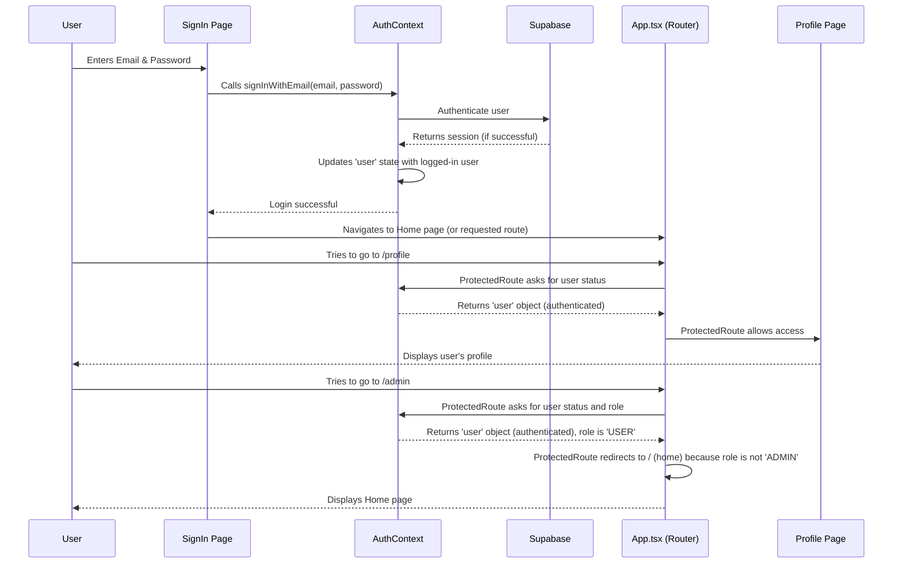

# Chapter 3: User Authentication & Authorization

Welcome back, HomeStead Haven explorer! In [Chapter 1: UI Design System (Glassmorphism & Framer Motion)](01_ui_design_system__glassmorphism___framer_motion__.md) we built the beautiful exterior and engaging features of our luxury platform. Then, in [Chapter 2: Global UI Layout & Theming](02_global_ui_layout___theming_.md), we designed the coherent structure and adaptable ambiance of our digital home.

Now, imagine our HomeStead Haven as a prestigious building. We've made it look stunning and easy to navigate, but what about security? Not everyone should be able to walk into the "residents-only" lounge or the "admin office." This is where **User Authentication & Authorization** comes in. It's like having a friendly, but very strict, security guard at the entrance.

This chapter is all about setting up this security system for HomeStead Haven. We'll learn how to:

*   **Authenticate Users**: This means verifying who you are. Can you prove you're a registered resident? (e.g., Signing up, logging in, logging out).
*   **Authorize Users**: This means controlling what you're allowed to do or see *after* you've proven your identity. Are you allowed into the admin office, or just your personal profile?

Our central goal for this chapter is to understand how a new user can **sign up**, **sign in**, then view their **personal profile page**, and how only specific users (like an admin) can access special **admin-only pages**. We'll also see how they can **log out** when they're done.

## What is User Authentication?

**Authentication** is the process of confirming a user's identity. It's like showing your ID to the security guard to prove you are who you say you are.

For HomeStead Haven, this involves:
*   **Signing Up (Registration)**: Creating a new account with an email and password.
*   **Signing In (Login)**: Entering your credentials (email/password or Google account) to prove you're an existing user.
*   **Logging Out**: Ending your session, essentially telling the security guard you're leaving the building.

## What is User Authorization?

**Authorization** is the process of deciding what an authenticated user is allowed to do or access. After the security guard confirms your ID, they then check your access level: Are you a regular resident, a property owner, or perhaps a building manager (admin)? This determines which rooms you can enter.

For HomeStead Haven, this means:
*   **User Roles**: Assigning different types of users (e.g., `Guest`, `User`, `Admin`) with different permissions.
*   **Protected Routes**: Ensuring certain pages (like a user's profile or the admin dashboard) can only be accessed by users with the correct role or who are logged in.

## Our "Security Guard": Supabase

HomeStead Haven uses **Supabase** as its secure backend for authentication. Think of Supabase as a professional security company that manages all the complex stuff: securely storing passwords, handling user registrations, and confirming identities. This means we don't have to build all that security logic ourselves, making our app more secure and easier to develop.

Supabase also handles different ways to sign in, like using your email and password, or even signing in easily with your Google account!

## How HomeStead Haven Achieves This

We use a special React feature called a **Context** to manage user information throughout our application. Our `AuthContext` is like a central hub that knows if someone is logged in, who they are, and provides functions for logging in and out.

### 1. `AuthContext`: The Central User Manager

The `AuthContext` is crucial. It holds the current user's information (`user`) and tells us if the authentication process is still running (`isLoading`). It also provides functions for all authentication actions.

Let's look at a simplified version of our `AuthContext.tsx` file:

```jsx
// context/AuthContext.tsx - Simplified
import React, { createContext, useContext, useState, useEffect } from 'react';
import { supabase } from '../services/supabaseClient'; // Our Supabase connection
import { User, UserRole } from '../types'; // User definitions

interface AuthContextType {
  user: User | null;       // The logged-in user object
  isLoading: boolean;      // True while checking login status
  signInWithEmail: (email: string, password: string) => Promise<{ error?: string }>;
  signUpWithEmail: (email: string, password: string, name: string) => Promise<{ error?: string }>;
  logout: () => Promise<void>;
  // ... (Other sign-in methods like Google)
}

const AuthContext = createContext<AuthContextType | undefined>(undefined);

export const AuthProvider: React.FC<{ children: React.ReactNode }> = ({ children }) => {
  const [user, setUser] = useState<User | null>(null);
  const [isLoading, setIsLoading] = useState(true);

  useEffect(() => {
    // 1. Check if user is already logged in with Supabase when app starts
    supabase.auth.getSession().then(({ data: { session } }) => {
      if (session?.user) {
        // Map Supabase user data to our app's user format
        setUser({ /* ... map user data ... */ role: UserRole.USER }); 
      }
      setIsLoading(false);
    });

    // 2. Listen for any login/logout changes in Supabase
    const { data: { subscription } } = supabase.auth.onAuthStateChange((_event, session) => {
      if (session?.user) {
        setUser({ /* ... map user data ... */ role: UserRole.USER });
      } else {
        setUser(null); // No user logged in
      }
      setIsLoading(false);
    });

    return () => subscription.unsubscribe(); // Clean up listener
  }, []);

  // Functions to interact with Supabase for auth
  const signInWithEmail = async (email, password) => { /* ... Supabase call ... */ };
  const signUpWithEmail = async (email, password, name) => { /* ... Supabase call ... */ };
  const logout = async () => { /* ... Supabase call ... */ };
  
  return (
    <AuthContext.Provider value={{ user, isLoading, signInWithEmail, signUpWithEmail, logout /* ... */ }}>
      {children}
    </AuthContext.Provider>
  );
};

export const useAuth = () => {
  const context = useContext(AuthContext);
  if (context === undefined) {
    throw new Error('useAuth must be used within an AuthProvider');
  }
  return context;
};
```

**Explanation:**
*   **`AuthContextType`**: Defines what data (`user`, `isLoading`) and functions (`signInWithEmail`, `logout`) are available from our `AuthContext`.
*   **`useState`**: `user` stores the currently logged-in user's details, or `null` if no one is logged in. `isLoading` tells us if we're still checking the user's login status.
*   **`useEffect`**: This powerful React hook automatically runs when the component loads.
    1.  It first checks if there's an existing login session with Supabase (`getSession`).
    2.  Then, it sets up a listener (`onAuthStateChange`) that automatically updates our `user` state whenever someone logs in or out through Supabase. This makes our app react instantly to auth changes!
*   **`AuthContext.Provider`**: This component wraps our entire application (as seen in `App.tsx`). It makes the `user`, `isLoading`, and all the authentication functions available to any component nested inside it.
*   **`useAuth`**: This is a custom hook that makes it super easy for any component to access the current `user` and auth functions without passing props manually.

### 2. User Roles: Defining Access Levels

Before we protect pages, we need to define who can do what. We use an `enum` (a special list of choices) called `UserRole` in `types.ts` to define different types of users:

```typescript
// types.ts - Snippet
export enum UserRole {
  GUEST = 'guest', // Not logged in
  USER = 'user',   // Regular logged-in user
  ADMIN = 'admin'  // Special administrative user
}

export interface User {
  id: string;
  name: string;
  email: string;
  avatar: string;
  role: UserRole; // Each user has a role
}
```

**Explanation:**
*   `GUEST`: Someone who is not logged in. They can browse properties but not create listings or access profiles.
*   `USER`: A standard logged-in user. They can view their profile, create listings, make bookings.
*   `ADMIN`: A super user with special privileges, like accessing an admin dashboard. In our code, the admin role is simply assigned to a specific email for demonstration.

### 3. Signing Up: Creating an Account

The `SignUp` page (`pages/SignUp.tsx`) is where new users create their accounts. It uses the `signUpWithEmail` function from our `AuthContext`.

```jsx
// pages/SignUp.tsx - Simplified
import React, { useState } from 'react';
import { useAuth } from '../context/AuthContext'; // Get our auth functions
import { motion } from 'framer-motion'; // For smooth animations (Chapter 1)

const SignUp: React.FC = () => {
  const [formData, setFormData] = useState({ username: '', email: '', password: '' });
  const [error, setError] = useState<string | null>(null);
  const [loading, setLoading] = useState(false);
  const { signUpWithEmail } = useAuth(); // Use the signUp function

  const handleChange = (e) => setFormData({ ...formData, [e.target.id]: e.target.value });

  const handleSubmit = async (e) => {
    e.preventDefault();
    setLoading(true);
    setError(null);
    const res = await signUpWithEmail(formData.email, formData.password, formData.username);
    if (res.error) {
      setError(res.error);
    } else {
      alert("Account created! Please sign in."); // Successful signup
    }
    setLoading(false);
  };

  return (
    <motion.div initial={{ opacity: 0, y: 20 }} animate={{ opacity: 1, y: 0 }} /* ... Glassmorphism styles ... */>
      <h1 className="text-3xl font-bold">Sign Up</h1>
      <form onSubmit={handleSubmit} className="flex flex-col gap-4">
        <input type="text" placeholder="Username" id="username" onChange={handleChange} required />
        <input type="email" placeholder="Email" id="email" onChange={handleChange} required />
        <input type="password" placeholder="Password" id="password" onChange={handleChange} required />
        <button disabled={loading}>
          {loading ? 'Loading...' : 'Sign Up'}
        </button>
      </form>
      {error && <p className="text-rose-500">{error}</p>}
      <p>Have an account? <Link to="/sign-in">Sign in</Link></p>
    </motion.div>
  );
};
export default SignUp;
```

**Explanation:**
*   The form collects `username`, `email`, and `password`.
*   When submitted, `handleSubmit` calls `signUpWithEmail` from `useAuth`.
*   This function then securely sends the data to Supabase, which creates the new user account.
*   Framer Motion (`motion.div`) adds a subtle animation as the form appears.

### 4. Signing In: Accessing Your Account

The `SignIn` page (`pages/SignIn.tsx`) is where existing users log in. It offers both email/password and Google login, using functions from `AuthContext`.

```jsx
// pages/SignIn.tsx - Simplified
import React, { useState } from 'react';
import { useAuth } from '../context/AuthContext'; // Get our auth functions
import { motion } from 'framer-motion'; // For smooth animations (Chapter 1)

const SignIn: React.FC = () => {
  const [formData, setFormData] = useState({ email: '', password: '' });
  const [error, setError] = useState<string | null>(null);
  const [loading, setLoading] = useState(false);
  const { signInWithEmail, signInWithGoogle } = useAuth(); // Use sign-in functions

  const handleChange = (e) => setFormData({ ...formData, [e.target.id]: e.target.value });

  const handleSubmit = async (e) => {
    e.preventDefault();
    setLoading(true);
    setError(null);
    const res = await signInWithEmail(formData.email, formData.password);
    if (res.error) {
      setError(res.error);
      setLoading(false);
    } else {
      setLoading(false);
      navigate('/'); // Redirect to home on success
    }
  };

  const handleGoogleSignIn = async () => {
    setLoading(true);
    setError(null);
    await signInWithGoogle(); // Supabase handles the redirect for Google
    // Loading stops automatically after redirect
  };

  return (
    <motion.div initial={{ opacity: 0, y: 20 }} animate={{ opacity: 1, y: 0 }} /* ... Glassmorphism styles ... */>
      <h1 className="text-3xl font-bold">Sign In</h1>
      <form onSubmit={handleSubmit} className="flex flex-col gap-4">
        <input type="email" placeholder="Email" id="email" onChange={handleChange} required />
        <input type="password" placeholder="Password" id="password" onChange={handleChange} required />
        <button disabled={loading}>{loading ? 'Loading...' : 'Sign In'}</button>
        <button type="button" onClick={handleGoogleSignIn}>Continue with Google</button>
      </form>
      {error && <p className="text-rose-500">{error}</p>}
      <p>Don't have an account? <Link to="/sign-up">Sign up</Link></p>
    </motion.div>
  );
};
export default SignIn;
```

**Explanation:**
*   The `handleSubmit` function calls `signInWithEmail`. If successful, the user is redirected to the home page (`/`).
*   `handleGoogleSignIn` calls `signInWithGoogle`, which initiates a pop-up or redirect to Google for authentication. Supabase then handles receiving the token and logging the user in.
*   Supabase automatically handles "remembering" the user's session, so they stay logged in even if they close and reopen the browser.

### 5. Logging Out: Leaving HomeStead Haven

When a user wants to end their session, they can log out from their profile page (`pages/Profile.tsx`).

```jsx
// pages/Profile.tsx - Simplified logout snippet
import React from 'react';
import { useAuth } from '../context/AuthContext'; // Get the logout function
import { useNavigate } from 'react-router-dom';
import { LogOut } from 'lucide-react'; // Icon

const Profile: React.FC = () => {
  const { user, logout } = useAuth(); // Get user and logout function
  const navigate = useNavigate();

  const handleSignOut = async () => {
    await logout(); // Call the logout function from AuthContext
    navigate('/sign-in'); // Redirect to sign-in page after logging out
  };

  if (!user) return <p>Please sign in.</p>; // Show message if no user

  return (
    <div className="p-4 max-w-5xl mx-auto pt-24">
      {/* ... Profile Card with user info ... */}
      <button onClick={handleSignOut} className="flex items-center justify-center gap-2 text-rose-500">
          <LogOut size={16} /> Sign Out
      </button>
      {/* ... other profile content ... */}
    </div>
  );
}
export default Profile;
```

**Explanation:**
*   The `handleSignOut` function calls `logout()` from `useAuth`.
*   This function tells Supabase to invalidate the current user's session.
*   Our `AuthContext`'s `onAuthStateChange` listener (from `useEffect`) picks up this change, clears the `user` state, and our app instantly knows the user is no longer logged in.
*   The user is then redirected to the sign-in page.

### 6. Authorization: `ProtectedRoute` Component

To control access based on whether a user is logged in and what their `role` is, we use a special component called `ProtectedRoute` in `App.tsx`.

```jsx
// App.tsx - Snippet for ProtectedRoute
import React from 'react';
import { Routes, Route, Navigate } from 'react-router-dom';
import { useAuth } from './context/AuthContext'; // Get auth info
import { UserRole } from './types'; // Get user roles

const ProtectedRoute: React.FC<{ children: React.ReactNode; roles?: UserRole[] }> = ({ children, roles }) => {
  const { user, isLoading } = useAuth(); // Get current user and loading state

  if (isLoading) return null; // Don't show anything while checking auth status

  if (!user) {
    // If no user and not specifically trying to access admin (which should redirect to home)
    if (roles?.includes(UserRole.ADMIN)) {
      return <Navigate to="/" replace />; // Admin-only page needs login, redirect to home if no user
    }
    return <Navigate to="/sign-in" replace />; // Regular protected page needs login
  }

  // If roles are specified (e.g., for admin dashboard) and user's role doesn't match
  if (roles && user && !roles.includes(user.role)) {
    return <Navigate to="/" replace />; // Redirect to home if user doesn't have required role
  }

  return <>{children}</>; // If all checks pass, render the protected content
};

const App: React.FC = () => {
  return (
    <AuthProvider> {/* Make sure AuthProvider wraps everything */}
      <Router>
        <Layout>
          <Routes>
            <Route path="/" element={<Home />} />
            {/* ... other public routes ... */}
            <Route 
              path="/profile" 
              element={
                <ProtectedRoute> {/* Only logged-in users can see their profile */}
                  <Profile />
                </ProtectedRoute>
              } 
            />
            <Route 
              path="/create-listing" 
              element={
                <ProtectedRoute> {/* Only logged-in users can create listings */}
                  <CreateListing />
                </ProtectedRoute>
              } 
            />
            <Route 
              path="/admin" 
              element={
                <ProtectedRoute roles={[UserRole.ADMIN]}> {/* Only ADMIN role can access */}
                  <AdminDashboard />
                </ProtectedRoute>
              } 
            />
          </Routes>
        </Layout>
      </Router>
    </AuthProvider>
  );
};
export default App;
```

**Explanation:**
*   **`ProtectedRoute`**: This component wraps the `element` for any route that needs protection.
*   **`children`**: This refers to the actual page component (e.g., `Profile`, `AdminDashboard`) that `ProtectedRoute` is protecting.
*   **`roles?: UserRole[]`**: An optional prop. If provided, it means only users with one of these specific roles can access the page.
*   **`useAuth()`**: Used to get the `user` object and `isLoading` status.
*   **Loading Check**: `if (isLoading) return null;` prevents flashing unauthenticated content while Supabase is still checking the login status.
*   **No User Check**: `if (!user)` checks if anyone is logged in. If not, it redirects them to the `/sign-in` page (or home if trying to access admin-only pages).
*   **Role Check**: `if (roles && user && !roles.includes(user.role))` checks if the logged-in `user` has one of the `roles` specified in the `ProtectedRoute` props. If not, they are redirected to the home page (`/`).
*   **Usage in `App.tsx`**: Notice how `/profile` is wrapped by `ProtectedRoute` without `roles`, meaning any logged-in user can access it. However, `/admin` is wrapped with `roles={[UserRole.ADMIN]}`, strictly enforcing that only users with the `ADMIN` role can enter.

## Under the Hood: The User Journey

Let's trace what happens when a user signs in and tries to access a protected page.



### Connecting to Code Files

Here’s a summary of where these concepts live in the HomeStead Haven codebase:

#### 1. `context/AuthContext.tsx`: The Heart of Authentication

This file defines the `AuthContext` and `AuthProvider`, which manage all user state and interactions with Supabase's authentication service. It's the central place for login, signup, and logout logic. Crucially, it uses `isSupabaseConfigured` from `services/supabaseClient.ts` to provide mock user data if Supabase isn't properly set up, ensuring the app is still functional for development.

#### 2. `App.tsx`: Routing and Authorization Enforcement

This file sets up the `Router` and defines all application routes. It wraps the entire application with `AuthProvider` to make user context available everywhere. More importantly, it contains the `ProtectedRoute` component, which is responsible for checking authentication status and user roles before allowing access to specific pages like `/profile` or `/admin`.

#### 3. `pages/SignIn.tsx` & `pages/SignUp.tsx`: User Entry Points

These pages provide the forms for users to create new accounts or log into existing ones. They leverage the `useAuth` hook to call the `signInWithEmail`, `signInWithGoogle`, and `signUpWithEmail` functions provided by `AuthContext`. They also handle displaying loading states and error messages.

#### 4. `pages/Profile.tsx`: User Management and Logout

The user's profile page displays their information and provides a button to log out. It uses the `logout` function from `useAuth` to securely end the user's session.

#### 5. `services/supabaseClient.ts`: Supabase Configuration

This file initializes the Supabase client, providing the connection details (URL and API key). It also includes a helpful check, `isSupabaseConfigured`, to warn if Supabase credentials aren't fully set up, allowing the app to fall back to mock data for authentication in development environments.

#### 6. `types.ts`: Defining User Structure and Roles

This file defines the `User` interface, which dictates the structure of our user objects, including their `id`, `name`, `email`, `avatar`, and critically, their `role` using the `UserRole` enum.

## Conclusion

In this chapter, you've learned how HomeStead Haven handles its "security." We've established a robust system by:

*   Using **Supabase** as a powerful and secure backend for all authentication (signing up, signing in, logging out).
*   Creating a global **`AuthContext`** that manages user state and provides authentication functions throughout the app.
*   Defining **`UserRole`s** to categorize users (Guest, User, Admin) and control what they can access.
*   Implementing a **`ProtectedRoute`** component that enforces authorization, ensuring users only access pages they are allowed to see based on their login status and role.

Now that users can securely log in and out, and we can control their access, it's time to give them something meaningful to interact with! In the next chapter, we'll dive into how users can create, view, and manage property listings on HomeStead Haven.

[Next Chapter: Property Listing Management](04_property_listing_management_.md)

---
