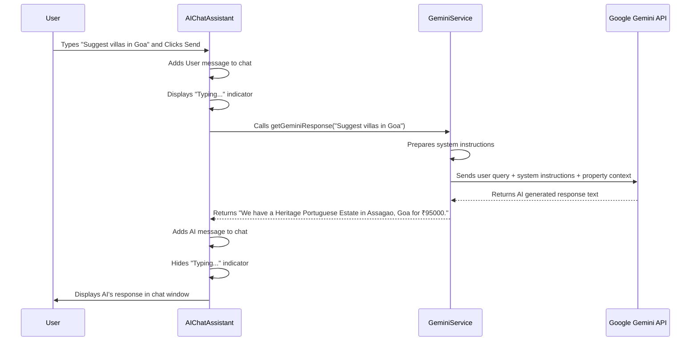

# Chapter 5: AI Chat Assistant (HavenHelper)

Welcome back to HomeStead Haven! In [Chapter 1: UI Design System (Glassmorphism & Framer Motion)](01_ui_design_system__glassmorphism___framer_motion__.md), we built the dazzling visual components. In [Chapter 2: Global UI Layout & Theming](02_global_ui_layout___theming_.md), we ensured our entire digital home had a consistent structure and could switch its ambiance. In [Chapter 3: User Authentication & Authorization](03_user_authentication___authorization__.md), we added the security system, allowing users to safely enter. And most recently, in [Chapter 4: Property Listing Management](04_property_listing_management_.md), we filled our home with beautiful property listings that users can browse and manage.

Now, imagine you're walking through a grand property showroom, and you have a personal concierge by your side, ready to answer any question, offer tailored advice, and guide you effortlessly. That's exactly what we're bringing to HomeStead Haven with our **AI Chat Assistant**, affectionately named **HavenHelper**.

This chapter is all about introducing HavenHelper, our intelligent virtual assistant. It's like having a knowledgeable friend available 24/7 to help you navigate the world of luxury properties. Our central goal for this chapter is to understand how a user can **open the HavenHelper chat window, ask a question about properties, and receive a helpful, intelligent response**.

## What is an AI Chat Assistant (HavenHelper)?

An **AI Chat Assistant** is a computer program designed to have conversations with users, understand their questions, and provide relevant answers or assistance. Think of it as a smart chatbot.

For HomeStead Haven, our AI Chat Assistant, **HavenHelper**, is specially trained to be your expert guide in the luxury property market.

*   **Interactive**: You can type your questions, and it will respond.
*   **Conversational**: It understands natural language, so you can talk to it like a real person.
*   **24/7 Availability**: Always there, day or night, to help you.
*   **Property Expert**: Its main job is to answer questions about our property listings, recommend options, and guide you through finding your dream home.

## The Brain Behind HavenHelper: Google Gemini AI

HavenHelper isn't just a simple chatbot with pre-written answers. It's powered by **Google Gemini AI**.

*   **Gemini AI**: This is an advanced Artificial Intelligence model developed by Google. It's like the super-smart "brain" that allows HavenHelper to understand complex questions, generate human-like text, and even reason about the information it's given (like our property listings!).
*   **Intelligent Insights**: Because it uses Gemini, HavenHelper can do more than just simple look-ups. It can interpret your needs, compare properties, and offer truly tailored recommendations.

## Key Concepts: Building Blocks of an AI Chat

To make HavenHelper work, we need a few key pieces:

### 1. Chat Messages: Displaying the Conversation

A chat assistant needs a way to show what the user says and what the AI responds. We define a `ChatMessage` structure in our `types.ts` file to keep track of each part of the conversation.

```typescript
// types.ts - Snippet
export interface ChatMessage {
  id: string;        // Unique ID for each message
  role: 'user' | 'model'; // Who sent the message? 'user' or 'model' (AI)
  text: string;      // The actual content of the message
  timestamp: Date;   // When the message was sent
}
```

**Explanation:**
This `ChatMessage` interface ensures that every message in our chat history has a consistent format, making it easy to display and manage. `role` is important for styling the messages (e.g., user messages on the right, AI messages on the left).

### 2. Giving the AI Context: Property Data

For HavenHelper to recommend properties, it needs to know *about* the properties! We feed it information from our existing property listings (which we discussed in [Chapter 4: Property Listing Management](04_property_listing_management__.md)).

This context helps the AI understand what properties are available, their locations, prices, and features, so it can give relevant answers.

## How HomeStead Haven Achieves This

Let's walk through how HavenHelper works, from clicking a button to getting an intelligent response.

### 1. The Interactive Chat Window

HavenHelper lives in a neat, floating chat window on the bottom right of your screen. It starts as a small button and expands into a full chat interface when clicked.

```jsx
// components/AIChatAssistant.tsx - Simplified UI structure
import React, { useState, useRef, useEffect } from 'react';
import { motion, AnimatePresence } from 'framer-motion'; // For animations
import { MessageSquare, Send, X, Bot, Sparkles } from 'lucide-react'; // Icons

const AIChatAssistant: React.FC = () => {
  const [isOpen, setIsOpen] = useState(false); // Controls if the chat window is open
  const [input, setInput] = useState('');     // Stores what the user types
  const [messages, setMessages] = useState<ChatMessage[]>([/* ... initial welcome message ... */]);
  // ... other state for typing indicator, etc.

  // Function to scroll to the bottom of the chat
  const messagesEndRef = useRef<HTMLDivElement>(null);
  useEffect(() => {
    messagesEndRef.current?.scrollIntoView({ behavior: 'smooth' });
  }, [messages, isOpen]); // Scroll when messages or open state changes

  return (
    <>
      {/* Floating Button (shown when chat is closed) */}
      <motion.button onClick={() => setIsOpen(true)} className="fixed bottom-6 right-6 z-40 /* ... styling ... */">
        <Sparkles className="animate-pulse" /> {/* A pulsing sparkle icon */}
      </motion.button>

      {/* Chat Window (shown when isOpen is true) */}
      <AnimatePresence>
        {isOpen && (
          <motion.div initial={{ opacity: 0, y: 50 }} animate={{ opacity: 1, y: 0 }} exit={{ opacity: 0, y: 50 }}
            className="fixed bottom-6 right-6 z-50 w-full max-w-sm h-[550px] bg-white rounded-2xl flex flex-col">
            
            {/* Header with AI info and Close button */}
            <div className="p-4 bg-gradient-to-r /* ... styling ... */">
              <h3 className="font-bold text-white text-sm">HavenHelper AI</h3>
              <button onClick={() => setIsOpen(false)} /* ... styling ... */>
                <X size={18} />
              </button>
            </div>

            {/* Messages Display Area */}
            <div className="flex-1 overflow-y-auto p-4 space-y-4 bg-slate-50">
              {messages.map((msg) => (
                <div key={msg.id} className={`flex ${msg.role === 'user' ? 'justify-end' : 'justify-start'}`}>
                  <div className={`max-w-[85%] rounded-2xl px-4 py-3 ${msg.role === 'user' ? 'bg-gradient-to-r text-white' : 'bg-white text-slate-700'}`}>
                    {msg.text}
                  </div>
                </div>
              ))}
              {/* ... typing indicator ... */}
              <div ref={messagesEndRef} /> {/* Element to scroll to */}
            </div>

            {/* Input Field and Send Button */}
            <div className="p-4 bg-white border-t border-slate-100">
              <input type="text" value={input} onChange={(e) => setInput(e.target.value)} placeholder="Ask about our villas..." />
              <button onClick={handleSend} /* ... styling ... */>
                <Send size={16} />
              </button>
            </div>
          </motion.div>
        )}
      </AnimatePresence>
    </>
  );
};

export default AIChatAssistant;
```

**Explanation:**
*   **`isOpen` state**: Controls the visibility of the chat window. Clicking the sparkling button sets `isOpen` to `true`.
*   **`AnimatePresence` and `motion.div`**: These Framer Motion components (from [Chapter 1: UI Design System (Glassmorphism & Framer Motion)](01_ui_design_system__glassmorphism___framer_motion__.md)) ensure the chat window smoothly fades in and out.
*   **`messages` state**: This array holds all the `ChatMessage` objects (user and AI messages).
*   **`useEffect` and `messagesEndRef`**: Whenever a new message is added or the chat opens, this makes sure the chat automatically scrolls to the bottom, showing the latest messages.
*   **Conditional Styling**: Notice how `msg.role === 'user'` changes the background color and alignment of messages, making it clear who said what.

### 2. Sending a Message and Getting an AI Response

When a user types a message and clicks "Send" (or presses Enter), a series of steps happen:

```jsx
// components/AIChatAssistant.tsx - Simplified handleSend function
// ... (imports and state as above)

const AIChatAssistant: React.FC = () => {
  // ... (state, useEffect, return JSX as above)

  const handleSend = async () => {
    if (!input.trim()) return; // Don't send empty messages

    const userMsg: ChatMessage = {
      id: Date.now().toString(),
      role: 'user',
      text: input,
      timestamp: new Date()
    };

    setMessages(prev => [...prev, userMsg]); // 1. Add user message to chat history
    setInput('');                          // 2. Clear the input field
    setIsTyping(true);                     // 3. Show a "typing..." indicator

    // 4. Send the user's message to Google Gemini AI
    const aiResponseText = await getGeminiResponse(userMsg.text);

    const aiMsg: ChatMessage = {
      id: (Date.now() + 1).toString(),
      role: 'model',
      text: aiResponseText,
      timestamp: new Date()
    };

    setMessages(prev => [...prev, aiMsg]); // 5. Add AI's response to chat history
    setIsTyping(false);                    // 6. Hide the typing indicator
  };

  // ... (handleKeyPress for Enter key)

  return (/* ... JSX ... */);
};
```

**Explanation:**
1.  **User Message Added**: The `userMsg` (what the user typed) is immediately added to the `messages` state, so the user sees their message in the chat.
2.  **Input Cleared**: The input box is cleared, ready for the next question.
3.  **Typing Indicator**: `setIsTyping(true)` shows a small animation, letting the user know the AI is thinking.
4.  **`getGeminiResponse` Call**: This is the magic step! We call a function `getGeminiResponse` (from `services/geminiService.ts`) and pass it the user's question. This function handles talking to the Google Gemini AI.
5.  **AI Response Added**: Once `getGeminiResponse` returns the AI's answer, we create an `aiMsg` and add it to the `messages` state.
6.  **Typing Indicator Hidden**: The typing animation goes away.

### 3. Talking to Google Gemini AI (`services/geminiService.ts`)

The `getGeminiResponse` function is where we communicate with the Google Gemini API. It's like the translator and messenger between our app and the AI brain.

```typescript
// services/geminiService.ts - Simplified
import { GoogleGenAI } from "@google/genai"; // Gemini AI library
import { MOCK_PROPERTIES } from '../constants'; // Our property data

export const getGeminiResponse = async (userQuery: string): Promise<string> => {
  // 1. Initialize Gemini AI with an API key
  const ai = new GoogleGenAI({ apiKey: process.env.API_KEY }); 

  try {
    // 2. Prepare property data for the AI to understand
    const propertyContext = JSON.stringify(MOCK_PROPERTIES.map(p => ({
      title: p.title,
      location: p.location,
      price: `₹${p.price}`,
      // ... other relevant property details ...
    })));

    // 3. Craft "System Instructions" to tell the AI its role and rules
    const systemInstruction = `
      You are 'HavenHelper', India's premier AI Luxury Property Specialist for HomeStead Haven. 
      Your goal is to assist users in finding exclusive luxury rentals and sales across India.
      Here is our current Indian property portfolio:
      ${propertyContext}
      Rules:
      1. Be polite, professional, and knowledgeable.
      2. Only recommend properties from the list provided above.
      3. Use '₹' (Rupees) when discussing prices.
      4. Keep responses concise (under 3 sentences) unless comparison is requested.
    `;

    const model = 'gemini-3-flash-preview'; // Which Gemini model to use
    
    // 4. Send the request to Gemini AI
    const response = await ai.models.generateContent({
      model: model,
      contents: userQuery,        // The user's actual question
      config: {
        systemInstruction: systemInstruction, // Our rules for the AI
      }
    });

    return response.text || "I'm having trouble..."; // Return AI's text response

  } catch (error) {
    console.error("Gemini API Error:", error);
    return "I apologize, but I am momentarily unavailable.";
  }
};
```

**Explanation:**
1.  **`GoogleGenAI` Initialization**: We create an instance of the Gemini AI client, providing it with an `API_KEY`. This key lets our app securely talk to Google's AI services.
2.  **`propertyContext`**: We take our `MOCK_PROPERTIES` (from `constants.ts`) and convert them into a structured text format (JSON string). This is how we "teach" the AI about our available properties.
3.  **`systemInstruction`**: This is a crucial part, acting like a detailed job description for HavenHelper. It tells the AI:
    *   **Who it is**: "HavenHelper, India's premier AI Luxury Property Specialist."
    *   **Its goal**: "assist users in finding exclusive luxury rentals and sales."
    *   **The data it has**: It includes our `propertyContext` right in the instructions, so the AI knows about our listings.
    *   **Specific rules**: Like "only recommend properties from the list" and "keep responses concise." This helps the AI stay focused and helpful.
4.  **`generateContent`**: This is the actual API call to Google Gemini. We specify the `model` we want to use, provide the `userQuery` (the user's question), and include our `systemInstruction`.
5.  **Response**: Gemini processes the request and sends back a `response` object, from which we extract the `response.text` – HavenHelper's answer!

## Under the Hood: HavenHelper's Thought Process

Let's visualize the journey of a user's question to HavenHelper and back.



### Connecting to Code Files

Here’s a summary of where HavenHelper's intelligence and interface live in the HomeStead Haven codebase:

#### 1. `components/AIChatAssistant.tsx`: The User Interface

This file is responsible for everything the user sees and interacts with for HavenHelper. It manages:
*   Opening and closing the chat window.
*   Displaying user and AI messages.
*   Handling user input and the "Send" button.
*   Visual feedback like the typing indicator.
*   Using Framer Motion for smooth animations.

#### 2. `services/geminiService.ts`: The AI Backend Communicator

This file contains the core logic for talking to Google Gemini AI:
*   Initializes the `GoogleGenAI` client.
*   Prepares our `MOCK_PROPERTIES` from `constants.ts` into a format the AI can understand.
*   Crafts detailed `systemInstruction` to guide the AI's behavior and knowledge.
*   Sends the user's query and the `systemInstruction` to the Google Gemini API.
*   Processes and returns the AI's text response.

#### 3. `types.ts`: Defining Chat Messages

The `ChatMessage` interface in this file provides the structured blueprint for every message in the chat conversation, ensuring consistency.

#### 4. `constants.ts`: Property Data for AI Context

This file contains `MOCK_PROPERTIES`, which is the very property data (locations, prices, descriptions, amenities) that `geminiService.ts` feeds to Google Gemini AI as `propertyContext`. This is how HavenHelper becomes knowledgeable about our listings.

```typescript
// constants.ts - Snippet
export const MOCK_PROPERTIES: Property[] = [
  {
    id: '1',
    title: 'Marine Drive Sky Villa',
    location: 'Worli, Mumbai',
    price: 450000,
    // ... other details
  },
  {
    id: '2',
    title: 'Heritage Portuguese Estate',
    location: 'Assagao, Goa',
    price: 125000,
    discountedPrice: 95000,
    // ... other details
  },
  // ... more properties ...
];
```
**Explanation:**
The `MOCK_PROPERTIES` array directly provides the real estate information that HavenHelper uses to answer questions and make recommendations. This acts as HavenHelper's knowledge base.

## Conclusion

In this chapter, you've met HavenHelper, our AI Chat Assistant, and learned how it provides intelligent, conversational support to users. We've seen how:

*   The `AIChatAssistant.tsx` component creates an engaging and animated user interface for the chat.
*   The `getGeminiResponse` function in `geminiService.ts` acts as the bridge to **Google Gemini AI**.
*   Crucially, we feed the AI `systemInstruction` and real **property data** (from `MOCK_PROPERTIES` in `constants.ts`) to make it a specialized expert for HomeStead Haven.
*   The `ChatMessage` interface in `types.ts` structures our conversations.

With HavenHelper adding a layer of intelligent guidance, users can now find their ideal property with even greater ease. But finding a property is just the first step! In the next chapter, we'll explore how users can actually **book** viewings for these properties and leave **reviews** once they've experienced them, closing the loop on their HomeStead Haven journey.

[Next Chapter: Booking & Review System](06_booking___review_system_.md)

---
