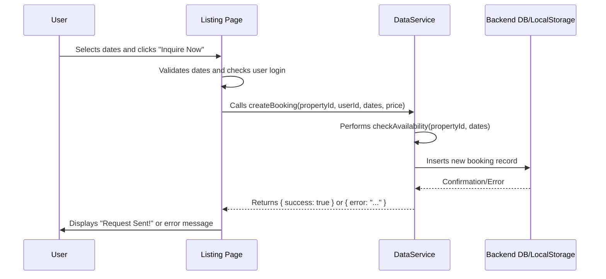
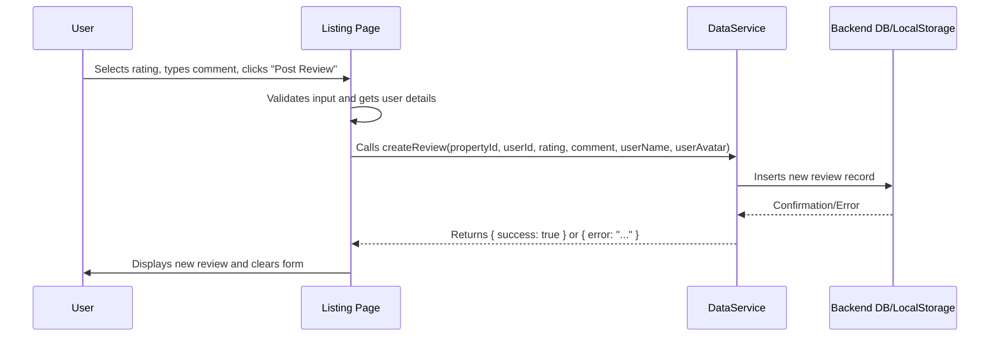

# Chapter 6: Booking & Review System

Welcome back to HomeStead Haven! In [Chapter 5: AI Chat Assistant (HavenHelper)](05_ai_chat_assistant__havenhelper__.md), we introduced HavenHelper, our intelligent AI assistant, to guide users through their property search with smart recommendations. Now that users can find properties and get expert advice, what's the next step in their journey? How do they actually express interest in a property or share their experience after visiting one?

Imagine HomeStead Haven as a luxury hotel. HavenHelper is your friendly concierge, helping you choose the perfect room. But once you've picked a room, you need to make a reservation at the front desk. And after your stay, you might want to leave feedback about your experience.

This chapter is all about HomeStead Haven's "front desk" and "feedback form." We'll explore the **Booking & Review System**, which allows users to formally inquire about properties and lets residents share valuable feedback. This system builds trust and facilitates interactions, much like a good customer service and reservation desk.

Our central goal for this chapter is to understand how a user can **submit a booking inquiry for a property** they're interested in, and later, **leave a rating and a written review** based on their experience. We'll also see how users can **view their own bookings and listings** on their profile.

## What is the Booking & Review System?

The Booking & Review System is a core feature that enables direct interaction with properties on HomeStead Haven. It has two main parts:

1.  **Booking Inquiry**: This allows a potential resident to express interest in a property. It's not a direct payment or reservation, but a formal request (e.g., for a viewing appointment or more information) that the property owner or our team will follow up on.
2.  **Resident Reviews**: After a stay or visit, this allows users to provide feedback. Reviews typically include:
    *   **Ratings**: A score (e.g., 1 to 5 stars) reflecting their satisfaction.
    *   **Comments**: A written description of their experience.

### Why is this system important?

*   **Facilitates Engagement**: It provides clear steps for users to move from browsing to interacting with a property.
*   **Builds Trust**: Transparent reviews from other residents help new users make informed decisions and build confidence in the listings.
*   **Quality Assurance**: Feedback helps property owners improve their offerings.

## Key Concepts: Data for Interaction

To manage bookings and reviews, we need to define their structure within our application. We do this using `interface` definitions in our `types.ts` file, similar to how we defined a `Property` in [Chapter 4: Property Listing Management](04_property_listing_management__.md).

### 1. The `Booking` Data Structure

A `Booking` represents a user's inquiry about a specific property for certain dates.

```typescript
// types.ts - Simplified
export interface Booking {
  id: string;          // Unique ID for the booking
  propertyId: string;  // ID of the property being booked
  userId: string;      // ID of the user making the booking (from AuthContext)
  date: string;        // Date the inquiry was made (e.g., "2023-10-27T10:00:00Z")
  startDate?: string;  // Optional: Proposed check-in date
  endDate?: string;    // Optional: Proposed check-out date
  status: 'pending' | 'confirmed' | 'cancelled'; // Current status
  totalPrice: number;  // Price relevant to the booking
}
```

**Explanation:**
This `Booking` interface captures all the essential details about a user's interest in a property. The `userId` links the booking to a specific user, and `propertyId` links it to a property.

### 2. The `Review` Data Structure

A `Review` holds a user's feedback, including their rating and comments.

```typescript
// types.ts - Simplified
export interface Review {
  id: string;          // Unique ID for the review
  propertyId: string;  // ID of the property being reviewed
  userId: string;      // ID of the user who wrote the review
  userName?: string;   // Optional: Name of the reviewer for display
  userAvatar?: string; // Optional: Avatar of the reviewer for display
  rating: number;      // Star rating (e.g., 1 to 5)
  comment: string;     // The textual feedback
  date: string;        // Date the review was submitted
}
```

**Explanation:**
The `Review` interface ensures that each piece of feedback is well-structured. It includes `userName` and `userAvatar` so we can display reviews nicely without needing to fetch full user profiles every time.

## How HomeStead Haven Achieves This

Let's walk through how HomeStead Haven implements the booking and review process, focusing on the user's journey.

### 1. Submitting a Booking Inquiry (`pages/Listing.tsx`)

When a user is on a `Listing` page, they can select desired `Check-In` and `Check-Out` dates and then click "Inquire Now."

```jsx
// pages/Listing.tsx - Simplified booking snippet
import React, { useState } from 'react';
import { useAuth } from '../context/AuthContext'; // To get current user
import { createBooking } from '../services/dataService'; // Our API calls

const Listing: React.FC = () => {
  // ... existing state for listing and loading ...
  const [startDate, setStartDate] = useState('');
  const [endDate, setEndDate] = useState('');
  const [bookingStatus, setBookingStatus] = useState<'idle' | 'success' | 'error'>('idle');
  const { user } = useAuth(); // Get logged-in user details (from Chapter 3)

  const handleBooking = async () => {
    if (!user) {
      alert("Please sign in to book this property.");
      return;
    }
    if (!startDate || !endDate || new Date(startDate) >= new Date(endDate)) {
      alert("Please select valid check-in/out dates.");
      return;
    }

    if (listing) { // 'listing' is the current property data
      const result = await createBooking({
        propertyId: listing.id,
        userId: user.id,
        totalPrice: listing.offer ? listing.discountedPrice : listing.price,
        status: 'pending', // All new inquiries start as pending
        startDate,
        endDate
      });
      
      if (result.success) {
        setBookingStatus('success'); // Show success message
      } else {
        setBookingStatus('error'); // Show error message
      }
    }
  };

  return (
    // ... JSX for displaying listing details ...
    <div className="sidebar-for-booking">
      {/* Input fields for startDate and endDate */}
      <input type="date" value={startDate} onChange={(e) => setStartDate(e.target.value)} />
      <input type="date" value={endDate} onChange={(e) => setEndDate(e.target.value)} />
      
      {/* Booking button or status message */}
      {bookingStatus === 'idle' ? (
        <button onClick={handleBooking}>Inquire Now</button>
      ) : bookingStatus === 'success' ? (
        <p>Request Sent! Our specialist will contact you.</p>
      ) : (
        <p>Booking failed. Please try again.</p>
      )}
    </div>
  );
};
```

**Explanation:**
*   `useState` hooks (`startDate`, `endDate`, `bookingStatus`) manage the form's state and the UI feedback.
*   `handleBooking` is called when the "Inquire Now" button is clicked.
*   It performs basic validation (user logged in, valid dates).
*   Then, it calls `createBooking` (from `services/dataService.ts`) with the property's ID, the current user's ID, the chosen dates, and the property's price.
*   The `bookingStatus` state is updated to show feedback (success or error) to the user.

### 2. Leaving a Review (`pages/Listing.tsx`)

On the same `Listing` page, below the property details, users who are logged in can leave a review.

```jsx
// pages/Listing.tsx - Simplified review snippet
import React, { useState } from 'react';
import { useAuth } from '../context/AuthContext'; // To get current user
import { createReview } from '../services/dataService'; // Our API calls
import { Star } from 'lucide-react'; // Icon for stars

const Listing: React.FC = () => {
  // ... existing state ...
  const [rating, setRating] = useState(5); // Default to 5 stars
  const [comment, setComment] = useState('');
  const [submittingReview, setSubmittingReview] = useState(false);
  const { user } = useAuth(); // Get logged-in user details

  const handleSubmitReview = async (e: React.FormEvent) => {
    e.preventDefault();
    if (!user || !listingId || !comment.trim()) return; // Must be logged in, have a property ID, and a comment

    setSubmittingReview(true);
    const result = await createReview({
        propertyId: listingId,
        userId: user.id,
        rating,
        comment,
        userName: user.name,
        userAvatar: user.avatar // Send user's name and avatar for the review display
    });

    if (result.success) {
        // Create a temporary review object to instantly update UI
        const newReview = { id: Date.now().toString(), propertyId: listingId, userId: user.id, rating, comment, date: new Date().toISOString(), userName: user.name, userAvatar: user.avatar };
        setReviews(prev => [newReview, ...prev]); // Add new review to the top of the list
        setComment(''); // Clear the comment input
        setRating(5);   // Reset rating
    } else {
        alert("Failed to submit review.");
    }
    setSubmittingReview(false);
  };

  return (
    // ... JSX for listing details and booking ...
    <div className="reviews-section">
      {user && ( // Only show form if user is logged in
        <form onSubmit={handleSubmitReview}>
          <h3>Leave a Review</h3>
          <div className="star-rating-buttons">
            {[1, 2, 3, 4, 5].map((star) => (
              <button type="button" key={star} onClick={() => setRating(star)}>
                <Star className={star <= rating ? 'filled' : 'empty'} />
              </button>
            ))}
          </div>
          <textarea value={comment} onChange={(e) => setComment(e.target.value)} placeholder="How was your stay?" required />
          <button type="submit" disabled={submittingReview}>
            {submittingReview ? "Posting..." : "Post Review"}
          </button>
        </form>
      )}

      {/* Display existing reviews */}
      <div className="reviews-list">
        {reviews.length > 0 ? (
          reviews.map((review) => (
            <div key={review.id} className="review-item">
              <p>Rating: {review.rating} stars</p>
              <p>{review.comment}</p>
              <p>By {review.userName} on {new Date(review.date).toLocaleDateString()}</p>
            </div>
          ))
        ) : (
          <p>No reviews yet.</p>
        )}
      </div>
    </div>
  );
};
```

**Explanation:**
*   `useState` hooks (`rating`, `comment`, `submittingReview`) manage the review form's state.
*   `handleSubmitReview` is called when the review form is submitted.
*   It ensures the user is logged in and has provided a comment.
*   It calls `createReview` (from `services/dataService.ts`), sending the property ID, user's details, rating, and comment.
*   On success, the new review is immediately added to the `reviews` state, instantly updating the UI without a page reload. The form is then cleared.
*   The `useEffect` in `Listing.tsx` also calls `fetchReviews` (from `services/dataService.ts`) when the page loads to display existing reviews.

### 3. Viewing Bookings and Listings (`pages/Profile.tsx`)

Users can see their booking history and properties they've listed on their `Profile` page. This page uses tabs to switch between "My Bookings" and "My Listings."

```jsx
// pages/Profile.tsx - Simplified data loading snippet
import React, { useState, useEffect } from 'react';
import { useAuth } from '../context/AuthContext'; // To get current user
import { fetchUserBookings, fetchUserListings, fetchPropertyById } from '../services/dataService'; // Our API calls
import { Booking, Property } from '../types';

const Profile: React.FC = () => {
  const { user } = useAuth();
  const [activeTab, setActiveTab] = useState<'listings' | 'bookings'>('bookings');
  const [userListings, setUserListings] = useState<Property[]>([]);
  const [userBookings, setUserBookings] = useState<(Booking & { propertyTitle?: string })[]>([]);

  useEffect(() => {
    const loadUserData = async () => {
      if (!user) return; // Must be logged in

      // Fetch user's listings (covered in Chapter 4)
      const listings = await fetchUserListings(user.id);
      setUserListings(listings);

      // Fetch user's bookings
      const bookings = await fetchUserBookings(user.id);
      // For each booking, also fetch the property title to display
      const enrichedBookings = await Promise.all(bookings.map(async (b) => {
          const prop = await fetchPropertyById(b.propertyId);
          return { ...b, propertyTitle: prop?.title || 'Unknown Property' };
      }));
      setUserBookings(enrichedBookings);
    };
    loadUserData();
  }, [user]); // Re-run when the user object changes (e.g., after login)

  // ... rest of the profile page JSX (tabs, display lists) ...

  return (
    <div className="profile-dashboard">
      <div className="tabs">
        <button onClick={() => setActiveTab('bookings')}>My Bookings</button>
        <button onClick={() => setActiveTab('listings')}>My Listings</button>
      </div>

      <div className="tab-content">
        {activeTab === 'bookings' && (
          <div className="bookings-list">
            {userBookings.map((booking) => (
              <div key={booking.id} className="booking-item">
                <p>Property: {booking.propertyTitle}</p>
                <p>Dates: {booking.startDate} to {booking.endDate}</p>
                <p>Status: {booking.status}</p>
              </div>
            ))}
          </div>
        )}
        {activeTab === 'listings' && (
          <div className="listings-list">
            {/* Display userListings here (from Chapter 4) */}
          </div>
        )}
      </div>
    </div>
  );
};
```

**Explanation:**
*   The `useEffect` hook, which runs when the `Profile` page loads (or when the `user` object changes), calls `loadUserData`.
*   `loadUserData` fetches both `userListings` (from [Chapter 4: Property Listing Management](04_property_listing_management__.md)) and `userBookings` using `fetchUserBookings` (from `services/dataService.ts`).
*   For bookings, it further enriches each booking with the property's `title` (by calling `fetchPropertyById` for each booking) so users can easily identify which property they booked.
*   The `activeTab` state controls which list (bookings or listings) is currently displayed.

## Under the Hood: The Lifecycle of a Booking and Review

Let's visualize the journey of a user submitting a booking inquiry and then a review.

### Booking Inquiry Journey

When a user inquires about a property:

1.  **User Action**: The user selects `Check-In` and `Check-Out` dates on the `Listing` page and clicks "Inquire Now."
2.  **Frontend Validation**: The `Listing.tsx` component validates the dates and checks if the user is logged in (using `useAuth` from [Chapter 3: User Authentication & Authorization](03_user_authentication___authorization__.md)).
3.  **Data Service Call**: It then calls `dataService.createBooking()`, passing the property's ID, user's ID, dates, and price.
4.  **Availability Check (Optional but Good Practice)**: Before saving, the `dataService` might perform a quick `checkAvailability` to ensure the dates aren't already booked or overlapping with existing confirmed bookings.
5.  **Data Persistence**:
    *   If HomeStead Haven is configured with a real backend (like Supabase), `dataService.createBooking()` makes an API call to insert a new record into the `bookings` table in the database.
    *   If running in local development mode (without Supabase configured), `dataService.createBooking()` saves the new booking directly to `localStorage`.
6.  **Confirmation/Error**: The `dataService` returns whether the booking was successful.
7.  **UI Update**: `Listing.tsx` updates the `bookingStatus` state to show a success message or an error.



### Review Submission Journey

When a user submits a review for a property:

1.  **User Action**: The user selects a `rating` (stars) and types a `comment` on the `Listing` page, then clicks "Post Review."
2.  **Frontend Validation**: The `Listing.tsx` component ensures the user is logged in and has provided a comment. It also gets the `userId`, `userName`, `userAvatar` from the `useAuth` hook.
3.  **Data Service Call**: It calls `dataService.createReview()`, passing the property's ID, user's details, rating, and comment.
4.  **Data Persistence**:
    *   If configured with a real backend, `dataService.createReview()` makes an API call to insert a new record into the `reviews` table in the database.
    *   If running in local development mode, `dataService.createReview()` saves the new review directly to `localStorage`.
5.  **Confirmation/Error**: The `dataService` returns whether the review submission was successful.
6.  **UI Update**: `Listing.tsx` immediately adds the new review to its `reviews` state, causing it to appear at the top of the reviews list, and clears the review form.



## Connecting to Code Files

This entire Booking & Review System relies on several interconnected files:

#### 1. `types.ts`: The Blueprint for Booking & Review Data

This file defines the `Booking` and `Review` interfaces, providing a consistent structure for all booking requests and feedback.

```typescript
// types.ts - Booking and Review interfaces
export interface Booking {
  id: string;
  propertyId: string;
  userId: string;
  date: string;
  startDate?: string;
  endDate?: string;
  status: 'pending' | 'confirmed' | 'cancelled';
  totalPrice: number;
}

export interface Review {
  id: string;
  propertyId: string;
  userId: string;
  userName?: string;
  userAvatar?: string;
  rating: number;
  comment: string;
  date: string;
}
```
**Explanation:** These interfaces are the foundational contracts that ensure every booking and review object in our system contains the expected information.

#### 2. `pages/Listing.tsx`: The Interaction Hub

This page is where users interact with the booking form and the review submission form. It also displays all existing reviews for a property. It uses the `useAuth` hook (from [Chapter 3: User Authentication & Authorization](03_user_authentication___authorization__.md)) to identify the current user and calls functions from `dataService.ts` to perform actions.

#### 3. `pages/Profile.tsx`: User's Personal Dashboard

On this page, logged-in users can view their past booking inquiries and the properties they have listed (as discussed in [Chapter 4: Property Listing Management](04_property_listing_management__.md)). It uses `fetchUserBookings` and `fetchUserListings` from `dataService.ts` to populate these lists.

#### 4. `services/dataService.ts`: The Central Data Manager

This file is the backbone of the Booking & Review System. It contains all the core functions for:
*   `createBooking()`: To save new booking inquiries.
*   `fetchUserBookings()`: To retrieve bookings made by a specific user.
*   `fetchReviews()`: To get all reviews for a particular property.
*   `createReview()`: To save new user reviews.
*   `checkAvailability()`: An important function to ensure requested dates for a booking are not already taken.

```typescript
// services/dataService.ts - Simplified booking/review functions
import { supabase, isSupabaseConfigured } from './supabaseClient'; // Backend connection (or fallback)
import { Booking, Review } from '../types'; // Data structures

// --- Local Storage Fallback Helpers ---
const getLocalBookings = (): Booking[] => { /* ... loads from localStorage ... */ };
const saveLocalBookings = (bookings: Booking[]) => { /* ... saves to localStorage ... */ };
const getLocalReviews = (): Review[] => { /* ... loads from localStorage ... */ };
const saveLocalReviews = (reviews: Review[]) => { /* ... saves to localStorage ... */ };

// --- Booking Functions ---
export const createBooking = async (bookingData: Partial<Booking>): Promise<{ success: boolean; error?: string }> => {
  // Check availability first
  const isAvailable = await checkAvailability(bookingData.propertyId!, bookingData.startDate!, bookingData.endDate!);
  if (!isAvailable) return { success: false, error: "Dates are already booked" };

  if (!isSupabaseConfigured) {
    // Save to local storage for offline/demo
    const bookings = getLocalBookings();
    bookings.push({ ...bookingData, id: Math.random().toString(36).substr(2, 9), status: 'pending', date: new Date().toISOString() } as Booking);
    saveLocalBookings(bookings);
    return { success: true };
  }
  // Logic to insert into Supabase 'bookings' table
  // ...
  return { success: true };
};

export const fetchUserBookings = async (userId: string): Promise<Booking[]> => {
  if (!isSupabaseConfigured) return getLocalBookings().filter(b => b.userId === userId);
  // Logic to fetch from Supabase 'bookings' table where user_id matches
  // ...
  return []; // Placeholder
};

export const checkAvailability = async (propertyId: string, startDate: string, endDate: string): Promise<boolean> => {
    if (!isSupabaseConfigured) { /* ... local storage check logic ... */ return true; }
    // Logic to query Supabase 'bookings' table for overlapping dates
    // ...
    return true; // Placeholder
};

// --- Review Functions ---
export const createReview = async (review: Partial<Review>): Promise<{ success: boolean; error?: string }> => {
  if (!isSupabaseConfigured) {
    // Save to local storage for offline/demo
    const reviews = getLocalReviews();
    reviews.unshift({ ...review, id: Math.random().toString(36).substr(2, 9), date: new Date().toISOString() } as Review);
    saveLocalReviews(reviews);
    return { success: true };
  }
  // Logic to insert into Supabase 'reviews' table
  // ...
  return { success: true };
};

export const fetchReviews = async (propertyId: string): Promise<Review[]> => {
  if (!isSupabaseConfigured) return getLocalReviews().filter(r => r.propertyId === propertyId);
  // Logic to fetch from Supabase 'reviews' table where property_id matches
  // ...
  return []; // Placeholder
};
```
**Explanation:** Each function in `dataService.ts` first checks `isSupabaseConfigured`. If `false` (meaning Supabase isn't connected), it seamlessly falls back to using `localStorage` for all operations, which is incredibly useful for local development and demonstration. If Supabase *is* configured, these functions handle the actual interaction with our backend database tables.

## Conclusion

In this chapter, you've learned how HomeStead Haven enables users to interact directly with properties beyond just browsing. We've established a robust **Booking & Review System** by:

*   Defining clear data structures (`Booking` and `Review` interfaces in `types.ts`) to manage interaction data.
*   Implementing forms on the `Listing.tsx` page to allow users to **submit booking inquiries** and **leave valuable feedback** through ratings and comments.
*   Allowing users to **view their booking history** on the `Profile.tsx` page.
*   Centralizing all data operations for bookings and reviews within `services/dataService.ts`, which gracefully handles both real backend integration and local storage for development.

This system closes the loop on the user journey, moving from discovery (with HavenHelper) to action and feedback, building a dynamic and trustworthy platform. But how exactly does `dataService.ts` manage to talk to a real database like Supabase *and* smoothly switch to local storage? In the next chapter, we'll peel back the layers and dive deep into how data is consistently managed and persisted across HomeStead Haven.

[Next Chapter: Data Persistence & Service Layer](07_data_persistence___service_layer_.md)

---
