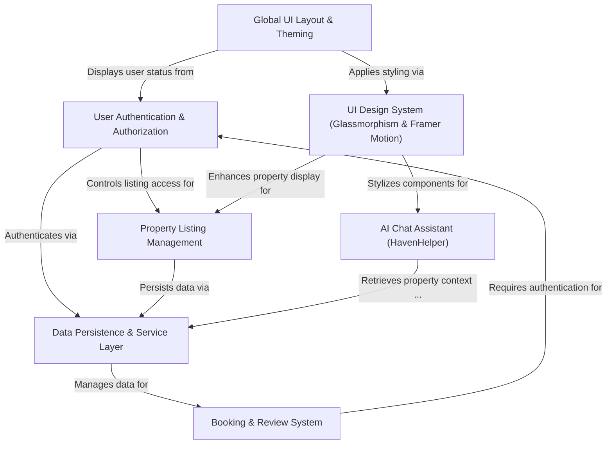

# 🏠 HomeStead Haven: Premium Indian Real Estate Ecosystem

**HomeStead Haven** is an avant-garde, 3D-inspired real estate marketplace designed to redefine the luxury property search experience in the Indian subcontinent. By merging high-fidelity **Glassmorphism UI** with **Google Gemini 3**'s generative intelligence, it transforms property browsing from a chore into an immersive digital journey.

🔗 **Live Platform:** [HomeStead Haven](https://homesteadhaven.netlify.app)

---

## 🚩 Problem Statement

The Indian luxury real estate market currently suffers from three critical pain points:

1.  **Visual Stagnation**: Most existing platforms (99acres, MagicBricks) utilize legacy grid designs that fail to convey the "prestige" and "aesthetic" of luxury properties.
2.  **Information Overload**: Users are often overwhelmed by thousands of non-verified listings, leading to "decision fatigue."
3.  **Static Interaction**: Traditional search filters are rigid. Users cannot ask natural questions like *"I need a sea-facing penthouse in Mumbai with EV charging"* and get a nuanced, human-like recommendation.

---

## 💡 The Proposed System

HomeStead Haven introduces a **"Concierge-First"** approach to real estate:

-   **Immersive Interface**: Utilizing **3D Tilt Geometry** and **Backdrop Blurs**, the system provides a tactile feel to property browsing, mimicking the "premium" nature of the assets.
-   **AI Property Specialist**: Integration of **HavenHelper (Gemini 3 Flash)** allows for a conversational discovery layer. The AI understands the specific amenities and vibes of each listing, acting as a virtual real estate agent.
-   **Curated Data Integrity**: A hybrid data layer (Supabase + Local Failover) ensures that only verified, high-quality listings are presented to the user.
-   **Seamless Lifecycle**: From discovery via AI to 3D exploration and one-click inquiries, the system closes the loop between "searching" and "staying."

---

## 🚀 Technical Architecture

### 🎨 Frontend & UI/UX
-   **React 19 & TypeScript**: Utilizing the latest React features for concurrent rendering and type-safe development.
-   **Tailwind CSS (Glassmorphism)**: A custom design system built on transparency, saturation, and blur to create a "glass" aesthetic.
-   **Framer Motion**: Powering the 3D transforms, entrance orchestrations, and interactive hover states.

### 🧠 Artificial Intelligence (HavenHelper)
-   **Engine**: `@google/genai` (Gemini 3 Flash).
-   **System Prompting**: Specialized personas designed for the Indian luxury market.
-   **Context Injection**: Real-time property data is fed into the LLM context, allowing it to provide accurate price, location, and feature details.

### ☁️ Backend & Infrastructure
-   **Supabase Auth**: Secure JWT-based authentication supporting Google OAuth and Email/Password.
-   **PostgreSQL**: Relational storage for properties, bookings, and user-generated reviews.
-   **Supabase Storage**: CDN-optimized hosting for high-resolution property imagery.
-   **Offline Sync**: Custom `dataService.ts` that detects configuration status and fails over to `localStorage` to maintain a 100% uptime demo experience.

---

## 🛠️ Feature Deep-Dive

### 1. The 3D Property Grid
Each property card is a 3D object. As the user moves their cursor, the card tilts in 3D space using spring physics, providing a sense of depth and quality that standard cards lack.

### 2. Verified Resident Feedback
A dual-layer review system where users can leave star ratings and comments. The UI dynamically fetches avatars and formats Indian currency (₹) to maintain local relevance.

### 3. Smart Inquiry Engine
The booking system validates dates in real-time. It calculates total costs based on "Rent vs Sale" logic and sends structured data to the admin dashboard for lead management.

### 4. HavenHelper AI Window
A persistent floating concierge that maintains chat history and uses generative AI to solve user doubts regarding neighborhood safety, pricing trends, and property comparisons.

---

## 📂 Directory Structure

```text
src/
├── components/        # Reusable UI (Navbar, Footer, AIChatAssistant, Admin)
├── context/           # Global State (Auth, Theme)
├── pages/             # Route Views (Home, Properties, Listing Detail)
├── services/          # API & AI Integrations (Gemini, Supabase)
├── constants.ts       # Fallback mock data and configuration strings
└── types.ts           # Centralized TypeScript interfaces
```

---

# Tutorial: HomeStead-Haven

HomeStead Haven is an **avant-garde real estate platform** for India, blending an *immersive 3D-inspired user interface* with a **smart AI chat assistant** for personalized property search. It provides a complete experience for **listing, booking, and reviewing luxury homes**, all secured by **robust user authentication** and supported by a flexible data system.


## Visual Overview



## Chapters

1. [UI Design System (Glassmorphism & Framer Motion)
](01_ui_design_system__glassmorphism___framer_motion__.md)
2. [Global UI Layout & Theming
](02_global_ui_layout___theming_.md)
3. [User Authentication & Authorization
](03_user_authentication___authorization_.md)
4. [Property Listing Management
](04_property_listing_management_.md)
5. [AI Chat Assistant (HavenHelper)
](05_ai_chat_assistant__havenhelper__.md)
6. [Booking & Review System
](06_booking___review_system_.md)
7. [Data Persistence & Service Layer
](07_data_persistence___service_layer_.md)

---

## 👨‍💻 Developer & Support

This platform is architected and maintained by **Sathwik Pamu**.

**For technical inquiries or partnerships:**
-   **Email:** [sathwikpamu@gmail.com](mailto:sathwikpamu@gmail.com)
-   **GitHub:** [github.com/sathwik-70](https://github.com/sathwik-70)
-   **LinkedIn:** [linkedin.com/in/sathwikpamu](https://linkedin.com/in/sathwikpamu)

---
HomeStead Haven. Luxury Living, Redefined.
